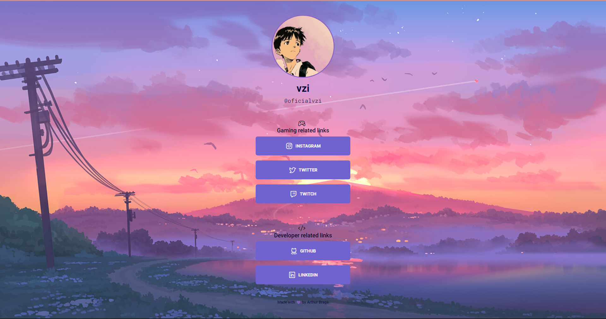

<h1 align="center">
  <b>Link Tree</b>🔗
</h1>

  

## Descrição do projeto
Esse projeto é um <i>linktree</i> ou seja, um link que contém outros links, e o desafio é da **[Maratona Explorer 2.0](https://lp.rocketseat.com.br/inscricao/maratona-explorer)**, que é um evento da **[Rocketseat](https://rocketseat.com.br)**.

## Tecnologias utilizadas
- HTML
- CSS